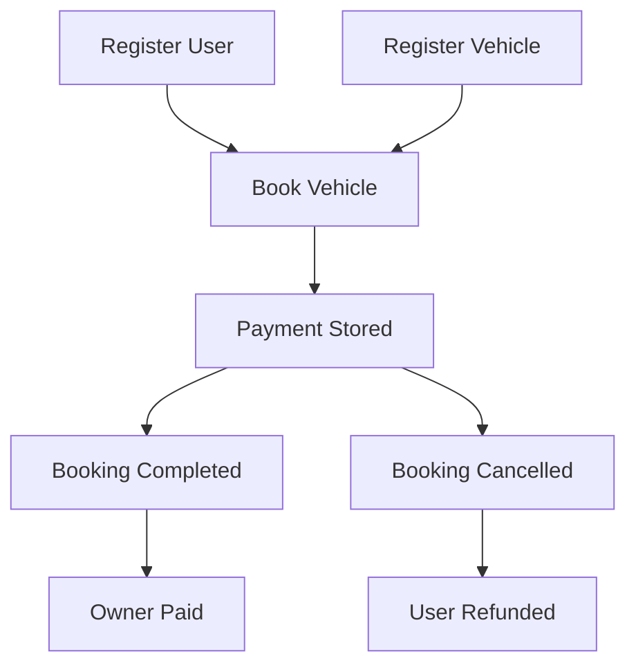

<div align="center">

# 🚗 Vehicle Rental Smart Contract

### A Decentralized Vehicle Rental System Built with Solidity

[](https://soliditylang.org/)
[](LICENSE)
[](https://ethereum.org/)
[]()
[]()

### Built with ❤️ while learning Smart Contract Engineering

</div>

---

# 📖 Overview

The **Vehicle Rental Smart Contract** is a decentralized application that enables vehicle owners to register vehicles and renters to securely book them on-chain.

The project demonstrates the implementation of **state management**, **Ether payments**, **access control**, **event logging**, and **booking lifecycle management** using Solidity.

This project is part of my journey toward becoming a **Protocol Engineer**, **Smart Contract Auditor**, and **Blockchain Security Researcher**.

---

# ✨ Features

## 👤 User Module

- Register new users
- Prevent duplicate registrations
- Store user information

---

## 🚗 Vehicle Module

- Register vehicles
- Update rental prices
- Remove vehicles
- Vehicle ownership validation

---

## 📅 Booking Module

- Book available vehicles
- Booking lifecycle management
- Cancel bookings
- Complete bookings
- Availability tracking

---

## 💰 Payment Module

- Secure Ether payments
- Owner payment settlement
- Refund on cancellation
- Payment validation

---

## 🔐 Security

- Ownership validation
- Input validation
- Booking state validation
- Vehicle availability checks
- Ether transfer using `call`
- Solidity modifiers
- Event logging

---

# 🏛 Smart Contract Architecture

```text
                         Vehicle Rental Contract
                                      │
          ┌───────────────────────────┼────────────────────────────┐
          │                           │                            │
      User Module               Vehicle Module              Booking Module
          │                           │                            │
          │                           │                            │
          └─────────────── Booking & Payment Flow ─────────────────┘
```

---

# 🔄 Booking Lifecycle

```text
                    Vehicle Registered
                            │
                            ▼
                    Available For Booking
                            │
                            ▼
                      User Books Vehicle
                            │
                            ▼
                     Payment Locked
                            │
             ┌──────────────┴──────────────┐
             │                             │
             ▼                             ▼
     Booking Completed             Booking Cancelled
             │                             │
             ▼                             ▼
       Owner Receives ETH          User Receives Refund
             │
             ▼
      Vehicle Available Again
```

---

# 📂 Project Structure

```text
Vehicle-Rental-Smart-Contract
│
├── contracts
│   └── VehicleRental.sol
│
├── docs
│
├── images
│
├── test
│
├── README.md
│
├── LICENSE
│
└── .gitignore
```

---

# 🧱 Smart Contract Components

## 📦 Structs

### Vehicle

| Field | Description |
|-------|-------------|
| Vehicle Number | Unique vehicle identifier |
| Vehicle Name | Vehicle model/name |
| Price | Rental price per hour |
| Availability | Booking status |
| Seating Capacity | Passenger capacity |
| Owner | Vehicle owner's wallet |

---

### User

| Field | Description |
|-------|-------------|
| Address | Wallet address |
| Name | User name |
| Age | User age |
| Phone | Contact number |

---

### Booking

| Field | Description |
|-------|-------------|
| Booking ID | Unique booking identifier |
| Rent Time | Rental start |
| Return Time | Rental end |
| Total Amount | Total payment |
| Vehicle Number | Booked vehicle |
| Renter | User wallet |
| Status | Booking lifecycle |

---

# 🔄 Booking Status

```solidity
enum BookingStatus {
    Pending,
    Booked,
    Completed,
    Cancelled
}
```

---

# 🗂 Storage Layout

```text
Vehicle Number
        │
        ▼
mapping(string => Vehicle)

Wallet Address
        │
        ▼
mapping(address => User)

Booking ID
        │
        ▼
mapping(uint => Booking)
```

---

# ⚙ Contract Workflow



---

# 📢 Events

The contract emits events to help front-end applications track blockchain activity.

- ✅ User Registered
- ✅ Vehicle Registered
- ✅ Vehicle Booked
- ✅ Booking Completed
- ✅ Booking Cancelled
- ✅ Vehicle Removed
- ✅ Price Updated

---

# 🛡 Security Features

✔ Ownership Verification

✔ Access Control

✔ Vehicle Validation

✔ Duplicate Registration Prevention

✔ Secure Ether Transfer using `call`

✔ Booking Status Validation

✔ Input Validation

✔ Event Logging

✔ Solidity Modifiers

---

# ⛽ Gas Optimization

Current optimizations include:

- Storage references
- Enum usage instead of multiple booleans
- Structured modifiers
- Reduced storage writes
- Event-driven architecture

Future optimizations:

- Custom Errors
- Immutable variables
- Constants
- Calldata optimization
- Packed structs

---

# 🚀 Future Roadmap

- [ ] ERC20 Payments
- [ ] Security Deposit
- [ ] Fleet Management
- [ ] Vehicle Categories
- [ ] User Booking History
- [ ] Vehicle Ratings
- [ ] Chainlink Automation
- [ ] Foundry Test Suite
- [ ] Gas Reports
- [ ] Slither Analysis
- [ ] Echidna Fuzz Testing
- [ ] Deployment Scripts

---

# 🧪 Testing

Testing will be added using **Foundry**.

Planned coverage:

- User Registration
- Vehicle Registration
- Booking
- Cancellation
- Payment
- Access Control
- Event Emission
- Edge Cases

---

# 📚 Learning Outcomes

This project helped me understand:

- Solidity Fundamentals
- Smart Contract Architecture
- State Management
- Structs
- Enums
- Modifiers
- Events
- NatSpec Documentation
- Ether Transfers
- Access Control
- Booking Lifecycle Design
- Git & GitHub Workflow

---

# 📸 Preview

    
    
    
    


---

# 👨‍💻 Author

## Gaurav Jadkar

🎓 Diploma in Computer Technology

### Aspiring

- ⚡ Protocol Engineer
- 🔍 Smart Contract Auditor
- 🛡 Blockchain Security Researcher
- 🌐 Blockchain Developer

---

### Connect With Me

- 💼 LinkedIn: https://linkedin.com/in/YOUR_PROFILE
- 💻 GitHub: https://github.com/YOUR_USERNAME

---

# ⭐ Support

If you found this project helpful, consider giving it a ⭐ on GitHub.

Contributions, suggestions, and feedback are always welcome.

---

<div align="center">

### Thank you for visiting this repository ❤️

**Happy Building on Ethereum 🚀**

